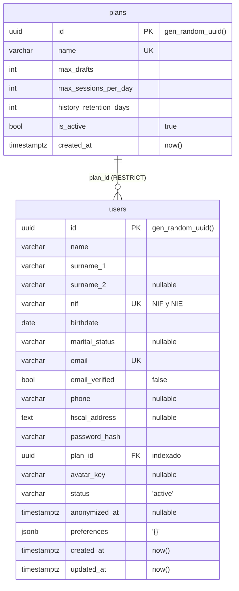

# Modelo de datos — issue #8

Capa de persistencia del proyecto: conexión a PostgreSQL, entidades ORM y sistema de migraciones.

**Stack:** PostgreSQL 17 · SQLAlchemy 2.0 síncrono · psycopg 3 · Alembic · pydantic-settings.

Documentación de referencia para trabajar con migraciones: [migrations/README.md](migrations/README.md).

---

## Arranque

```powershell
docker compose up -d --wait     # levanta Postgres y espera a que acepte conexiones
uv sync                         # instala dependencias
uv run alembic upgrade head     # crea las tablas
```

No hace falta configurar nada: la URL de la base viene por defecto apuntando al `docker-compose`.
En CI y en despliegue se sobrescribe exportando `DATABASE_URL`.

Para arrancar la API:

```powershell
uv run python -m uvicorn app:app --app-dir src
```

y comprobar que la base responde: **http://localhost:8000/health/db** → `{"db":"ok"}`

---

## El modelo



**`plans`** — límites de uso por plan de suscripción.

**`users`** — cuatro bloques: identidad, contacto, cuenta y ciclo de vida.

- `surname_2` es opcional: muchos extranjeros tienen un solo apellido.
- `nif` admite formato NIF y NIE. Solo el campo, la validación es de otro issue.
- `avatar_key` guarda la clave del object storage, no la imagen.
- `status` prevé `active`, `erasure_requested` y `anonymized`.
- **No incluye `sexual_orientation`**: categoría especial del art. 9 RGPD, decisión de equipo.

---

## Cómo encaja

```
src/config/settings.py          de dónde sale la configuración
        ↓
src/storage/connectors/db.py    engine + pool, SessionLocal, get_db, Base
        ↓
src/storage/entities/           plan.py, user.py  →  Base.metadata
        ↓
migrations/env.py               compara Base.metadata con la base real
        ↓
migrations/versions/            una migración por cambio, versionada en git
```

Un endpoint que necesite base de datos pide la sesión por inyección de dependencias:

```python
@router.get("/db")
def check_db(db: Session = Depends(get_db)):
    db.execute(text("SELECT 1"))
    return {"db": "ok"}
```

Es una función `def` normal, no `async def`: SQLAlchemy es síncrono y FastAPI ejecuta estos
endpoints en un threadpool, sin bloquear el event loop.

---

## Qué se puede comprobar

Salida real de la prueba funcional sobre la base recién creada:

```
1. Crear un plan
   id         : 84bf7acc-e1c0-4ccd-b644-fc9b32570a0f   (lo generó Postgres, tipo UUID)
   is_active  : True                                   (valor por defecto de la columna)

2. Dar de alta un usuario con ese plan
   status         : 'active'      (por defecto)
   email_verified : False         (por defecto)
   created_at     : 2026-08-02 14:40:46.245481+00:00
   ¿con zona horaria? True

3. La integridad se cumple
   email repetido   -> RECHAZADO (duplicate key value violates unique constraint "uq_users_email")
   plan inexistente -> RECHAZADO (violates foreign key constraint)
   ¿el error filtra el password_hash? False

4. ON DELETE RESTRICT
   borrar un plan con usuarios -> RECHAZADO

5. JSONB
   búsqueda por contenido -> ana@ejemplo.com, tema=oscuro
   tras mutar in-place    -> {'tema': 'oscuro', 'idioma': 'es', 'notificaciones': True}

6. updated_at se actualiza solo
   antes   : 14:40:46.313983+00:00
   después : 14:40:46.385575+00:00
```

El punto 3 importa: **las excepciones de base de datos no filtran datos personales al log.**
Sin `hide_parameters=True`, un alta con email repetido dejaría el hash de la contraseña, el
teléfono y la dirección fiscal escritos en el log del servidor.

---

## Migraciones

El esquema se versiona con Alembic. Cada cambio genera un fichero que se commitea como código:

```python
def upgrade():   op.create_table("users", ...)
def downgrade(): op.drop_table("users")
```

Quien haga `git pull` ejecuta `alembic upgrade head` y su base se pone al día **sin perder datos**.

```powershell
uv run alembic current    # en qué versión está esta base
uv run alembic history    # todas las migraciones
uv run alembic check      # ¿el código y la base coinciden?
```

`alembic check` corre en CI: si alguien cambia una entidad y olvida generar la migración, el PR
se pone en rojo.

---

## Tests

```powershell
uv run pytest --test-alembic
```

```
tests/conftest.py::pytest-alembic::test_model_definitions_match_ddl PASSED
tests/conftest.py::pytest-alembic::test_single_head_revision        PASSED
tests/conftest.py::pytest-alembic::test_up_down_consistency         PASSED
tests/conftest.py::pytest-alembic::test_upgrade                     PASSED
tests/test_demo.py::test_sum_dummy                                  PASSED
tests/test_health_db.py::test_health_db_ok                          PASSED
```

Los cuatro primeros comprueban que el esquema sube, baja y coincide con el código. Corren contra
una base **aparte** (`db_test`, puerto 5433, en memoria) porque hacen `downgrade` hasta base, o sea
DROP de todas las tablas. Si `TEST_DATABASE_URL` apuntase a la base de desarrollo, los tests fallan
antes de tocar nada.

El CI levanta dos Postgres, aplica las migraciones y ejecuta todo esto en cada pull request.

---

## Decisiones y por qué

| Decisión | Motivo |
|---|---|
| PostgreSQL, no Mongo | Datos fiscales: hacen falta transacciones e integridad referencial. Y con `jsonb` también se guardan documentos |
| SQLAlchemy **síncrono** | Menos complejidad y menos trampas que el async. FastAPI lo absorbe con su threadpool |
| psycopg 3, no psycopg2 | Mantenido activamente, soporte real de tipos de Postgres |
| `ON DELETE RESTRICT`, nunca CASCADE | Un borrado en cascada sobre datos personales es irreversible. La supresión será un proceso de anonimización controlado |
| `timestamptz` en todos los instantes | Sin zona, el valor guardado depende de la zona de quien insertó. El contenedor va en UTC y los clientes en Europe/Madrid |
| UUID en vez de enteros | No revela cuántos usuarios hay ni permite recorrer la tabla probando ids |
| Restricciones con nombre propio | Sin ellas, Alembic no sabe cómo referirse a una restricción para borrarla en un `downgrade` |
| `jsonb` para `preferences` | Lo que varía entre usuarios y no merece columna propia. Se consulta e indexa dentro, y Postgres valida que el JSON esté bien formado |

---

## Pendiente

- **Sembrar un plan por defecto.** `plan_id` es NOT NULL y `plans` nace vacía: hoy hay que crear un
  plan a mano antes de dar de alta al primer usuario.
- **Estrategia de anonimización.** Las columnas de identidad son NOT NULL, así que habrá que
  sobrescribirlas, no vaciarlas. Falta decidir con qué valores.
- **Validar `status`**, que hoy admite cualquier cadena.
- **Normalizar `email` y `nif`**: el UNIQUE de Postgres distingue mayúsculas, así que `12345678z` y
  `12345678Z` conviven como dos personas distintas.
- **Embeddings del RAG**: `pgvector` en esta misma base o almacén aparte.

Fuera de alcance de este issue: `Dockerfile`, backups automatizados, object storage para los avatares.
