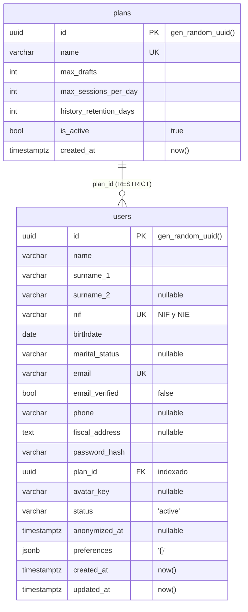

# Capa de persistencia y modelo de datos

Qué hay en `src/storage/`, cómo se escribe una entidad y por qué está montado así.
**Aquí no hay ni un comando**: eso está en [migrations/Guide.md](../migrations/Guide.md).
Rutas relativas a la raíz del repositorio.

**Stack:** PostgreSQL 17 · SQLAlchemy 2.0 **síncrono** · **psycopg 3** · Alembic · pydantic-settings.
Nada de async engine, nada de psycopg2, y **el esquema nunca se crea con `create_all()`**.

> **Las secciones 1 a 6 son lo que se consulta escribiendo código.** De la 7 en adelante, el porqué.

## 1. Las reglas de modelado

1. **La anotación decide la nulabilidad.** `Mapped[str]` es NOT NULL, `Mapped[str | None]` admite NULL.
   No se escribe `nullable=`.
2. **Todo valor por defecto es del servidor**, con `server_default=text(...)`. Nunca `default=` de
   Python: ese solo se aplica cuando el INSERT pasa por el ORM, y una migración o un `psql` lo saltan.
3. **`text()` es obligatorio.** `server_default="now()"` guarda la cadena literal `now()`.
4. **Mixins primero, `Base` al final:** `class User(UUIDPrimaryKey, Timestamped, Base)`.
5. **Un solo mixin de fechas.** `Timestamped` ya hereda de `CreatedAt`; poner los dos duplica la
   columna. `CreatedAt` a secas si no hace falta `updated_at`.
6. **Entidad nueva, una línea en `entities/__init__.py`.** Alembic solo ve las clases importadas.
7. **`ondelete` va en `ForeignKey`, nunca en `relationship()`**, que no emite DDL. Y siempre `RESTRICT`.
8. **Toda FK va indexada.** Postgres no crea índice en el lado que apunta, y sin él cada borrado en la
   tabla referenciada recorre esta entera.
9. **Toda columna JSONB va envuelta:** `MutableDict.as_mutable(JSONB(none_as_null=True))`.
10. **Toda `CheckConstraint` lleva `name=`.** Sin él salta `InvalidRequestError` al importar el módulo.

## 2. Los fallos silenciosos

Los tres errores que **no producen ningún error**.

**JSONB sin `MutableDict`.** `obj.preferences["x"] = 1` + `commit()` **no emite UPDATE**: el cambio se
pierde. SQLAlchemy detecta cambios por identidad del objeto, no por contenido. Solo rastrea el primer
nivel: para dicts anidados, reasignar el atributo entero.

**`updated_at` sin trigger.** El `onupdate` lo resuelve SQLAlchemy, no Postgres: no genera DDL. Un
UPDATE desde `psql` o desde una migración deja la columna obsoleta.

**Entidad sin registrar, cuando la migración lleva otro cambio.** Si quedaría vacía, `env.py` aborta con
`SystemExit: Nada que migrar…`. Pero si lleva cualquier otro cambio la salvaguarda no salta y **la tabla
se omite en silencio**. `alembic check` tampoco lo ve: compara "sin tabla" contra "sin tabla".

## 3. Esqueleto de una entidad

```python
# src/storage/entities/document.py
from storage.base import Base                                    # nunca desde connectors/db
from storage.entities.mixins import Timestamped, UUIDPrimaryKey


class Document(UUIDPrimaryKey, Timestamped, Base):               # mixins primero, Base al final
    __tablename__ = "documents"                                  # plural, snake_case, inglés

    user_id: Mapped[uuid.UUID] = mapped_column(
        ForeignKey("users.id", ondelete="RESTRICT"),             # ondelete aquí, y RESTRICT
        index=True,                                              # Postgres no lo crea solo
    )
    storage_key: Mapped[str] = mapped_column(String(512))        # sin `| None` → NOT NULL
    is_public: Mapped[bool] = mapped_column(server_default=text("false"))
```

## 4. Tres tipos prohibidos

El mapeo anotación → columna es el estándar de SQLAlchemy, con una excepción propia:
**`Mapped[datetime.datetime]` da `TIMESTAMPTZ`**, con la zona ya incluida ([§9](#9-basepy-y-los-mixins)).

- **`ENUM` nativo de Postgres.** `create_table` emite el `CREATE TYPE` pero `drop_table` no emite el
  `DROP TYPE`: el ciclo `downgrade base` + `upgrade head` aborta con `DuplicateObject`. Usa
  `String(n)` + `CheckConstraint`.
- **`Float` para dinero** (binario, no representa los decimales exactos): usa `Numeric(p, s)`.
  **`LargeBinary` para ficheros**: van al object storage; en la tabla, la clave, como `users.avatar_key`.

## 5. Reglas para el código que toca la base

- **Endpoints `def`, no `async def`.** El engine es síncrono y FastAPI saca las funciones `def` a un
  threadpool; con `async def` cada consulta bloquearía el event loop.
- **No devuelvas la entidad ORM.** `get_db` cierra la sesión en el `finally`, FastAPI serializa después
  y el acceso a un atributo expirado revienta con `DetachedInstanceError`. La conversión a Pydantic va
  dentro del endpoint; para eso está `src/models/`.
- **`autoflush=False`**: para leer en la misma transacción lo que acabas de escribir, `flush()` explícito.
- **No salen por la API**: `password_hash` nunca; `nif`, `birthdate` y `fiscal_address` salvo que el
  endpoint lo justifique. `avatar_key` es una clave interna, no una URL.

## 6. Lo que hoy no se puede hacer

- **`plans` nace vacía** y `users.plan_id` es NOT NULL, así que no se puede dar de alta a nadie hasta
  que exista un plan. Mientras no se decida dónde vive el seed ([§18](#18-hoja-de-ruta-del-modelo)):
  ```sql
  INSERT INTO plans (name, max_drafts, max_sessions_per_day, history_retention_days)
  VALUES ('free', 3, 10, 30);
  ```
- **`status` acepta cualquier cadena.** Es `String(32)` sin CHECK; `active`, `erasure_requested` y
  `anonymized` viven solo en un comentario.
- **`email` y `nif` distinguen mayúsculas**, así que `12345678z` y `12345678Z` conviven como dos personas.
- **No hay `relationship()`** (solo columnas FK, no existe `User.plan`) **ni soft delete**: el ciclo de
  vida se modela con `status` + `anonymized_at`.
- **`src/models/`, `storage/crud/` y `api/controllers/` están vacíos.** La frontera está documentada,
  no implementada.

---

> **Fin de lo imprescindible.** De aquí abajo, el porqué.

## 7. El esquema actual



**`plans`** — límites de uso por plan. Usa `CreatedAt`, no `Timestamped`.

**`users`** — identidad, contacto, cuenta y ciclo de vida. `surname_2` es opcional porque muchos
extranjeros tienen un solo apellido, y el `nif` no se valida todavía. **No incluye
`sexual_orientation`**: art. 9 RGPD, decisión de equipo.

## 8. Cómo se enlaza todo

```
alembic.ini                    script_location + prepend_sys_path. SIN credenciales
migrations/env.py              se ejecuta en cada comando de alembic
migrations/versions/           una migración por fichero, encadenadas
src/config/settings.py         configuración tipada: entorno > .env > defecto
src/storage/base.py            Base: metadata, nombres de restricciones y tipos
src/storage/connectors/db.py   engine, pool, SessionLocal, get_db
src/storage/entities/          las tablas; __init__.py es el registro
src/models/                    esquemas Pydantic de la API. NO son tablas, aunque
                               user.py exista en los dos sitios
```

Hay **dos ramas** que solo se cruzan en `env.py` — arriba el papel (qué tablas deberían existir), abajo
el cable. **Importar el modelo no arrastra el engine**: describir tablas no requiere driver ni
configuración, y por eso `base.py` está separado de `connectors/db.py`.

```
base.py → entities/ → Base.metadata ────┐
                                        ├──→ env.py ──→ versions/
settings.py → connectors/db.py ─────────┘
```

## 9. `base.py` y los mixins

**`NAMING_CONVENTION`** — la plantilla de nombres:

| Clave | Plantilla | Ejemplo |
|---|---|---|
| `ix` / `uq` | `ix_%(table_name)s_%(column_0_N_name)s` | `ix_users_plan_id`, `uq_users_email` |
| `ck` | `ck_%(table_name)s_%(constraint_name)s` | `ck_users_status` |
| `fk` | `fk_%(table_name)s_%(column_0_name)s_%(referred_table_name)s` | `fk_users_plan_id_plans` |
| `pk` | `pk_%(table_name)s` | `pk_users` |

Es `column_0_N_name` y no `column_0_name` para que un índice sobre `(a)` y otro sobre `(a, b)` no
choquen. Y la plantilla `ck` obliga a que toda `CheckConstraint` lleve `name=`: sin él la interpolación
falla al importar.

**Está congelada desde la primera migración, y no se toca sin hablarlo:** con los nombres que inventa
Postgres por su cuenta, un `downgrade` no puede referirse a la restricción que tiene que borrar, y
cambiarla obliga a renombrar restricciones a mano en todos los entornos. Un test lo blinda.

**`type_annotation_map`** mapea `datetime` a `TIMESTAMPTZ` para todas las tablas: sin zona, el instante
dependería de la de quien insertó. **Los mixins** aportan `id`, `created_at` y `updated_at` con
`server_default`, y usan `sort_order` (`id` = -100, fechas = 100 y 101) para que el orden físico tenga
sentido; sin él las heredadas irían al final y el `id` quedaría en medio.

## 10. El engine, el pool y la privacidad

| Parámetro | Valor | Por qué |
|---|---|---|
| `pool_pre_ping` | `True` | Descarta conexiones muertas antes de usarlas |
| `pool_size` / `max_overflow` | 5 / 10 | Techo de conexiones simultáneas |
| `pool_recycle` | 1800 | Cierra antes de que las corte un intermediario |
| `pool_timeout` | 5 | Espera por un hueco **del pool** |
| `connect_timeout` | 5 | Espera por el **connect TCP**, que es otra cosa |
| `echo` | `False` | Nunca `True`: volcaría datos personales al log |
| `hide_parameters` | `True` | Requisito de privacidad ([§15](#15-privacidad-y-rgpd)) |

El *pool* es el conjunto de conexiones que se reutilizan en vez de abrir una por consulta. Sin
`connect_timeout` manda el sistema operativo, que tarda **~130 s** en agotar los reintentos TCP cuando
los paquetes se pierden (contenedor caído, IP equivocada): por eso va en **todos** los `create_engine`
del repo, incluidos el de `env.py` y los de los tests.

## 11. Configuración: `settings.py` y `alembic.ini`

Precedencia **entorno > `.env` > defecto**. El `env_file` se resuelve a ruta absoluta para poder lanzar
`alembic` o `pytest` desde cualquier directorio, y `extra="ignore"` hace que las claves no declaradas no
revienten el arranque (las declaradas con el tipo equivocado, sí). Las URLs por defecto usan
**`127.0.0.1`, no `localhost`**: en Windows `localhost` resuelve primero a `::1` y docker publica solo
en IPv4.

De `alembic.ini`: **`sqlalchemy.url` está comentada a propósito** —la URL sale de `settings`, así que
aplicación y migraciones comparten fuente y no hay credenciales versionadas—; **`prepend_sys_path =
%(here)s/src`** (y `pythonpath = ["src"]` en pytest) es la razón de que los imports **nunca lleven
`src.`**, porque `src` es la raíz del path y no un paquete; y se lee con `encoding="locale"`, así que
sus comentarios van **sin tildes** o salen como mojibake en el runner Linux, y los `%` van duplicados.

## 12. Cómo funciona Alembic por dentro

**Por qué no `create_all()`.** Solo crea las tablas que faltan: sobre una que ya existe no altera nada
ni avisa. Lo aplicado vive en `alembic_version`, una tabla de una fila que **registra qué se aplicó, no
qué existe**: un `ALTER TABLE` a mano por `psql` la deja mintiendo, y desde ahí el autogenerate produce
diffs falsos. `base` es el estado vacío, `head` el último eslabón de la cadena.

**Qué decide `env.py`**, que es lo que no viene de fábrica:

- `target_metadata = Base.metadata`, previo `import storage.entities` para poblarlo.
- **`compare_type=True` y `compare_server_default=True`**, desactivadas por defecto. Sin ellas, un
  `String(50)`→`String(100)` o un cambio de `server_default` pasarían desapercibidos.
- **La salvaguarda `abortar_si_no_hay_cambios`**: en `--autogenerate`, si el resultado quedaría vacío
  aborta en vez de escribir un fichero inútil, porque `alembic check` no detecta ese caso. Su límite
  está en [§2](#2-los-fallos-silenciosos).
- **La conexión que inyecta pytest-alembic** por `config.attributes["connection"]` — la salvaguarda
  completa y su agujero, en [Guide §17](../migrations/Guide.md#17-tests-de-migraciones).

Postgres soporta DDL transaccional, y `env.py` abre una transacción **por ejecución**, no por migración:
si `upgrade head` aplica cinco y la cuarta falla, se revierten las cinco. No sustituye al backup.

## 13. Límites del autogenerate

Compara dos fotos del esquema: `Base.metadata` contra la base real. **No interpreta intenciones ni mira
el contenido de las filas.** Qué acierta y qué no, en [Guide §5](../migrations/Guide.md#5-modificar-una-tabla)
y [§13](../migrations/Guide.md#13-dónde-el-autogenerate-se-equivoca).

## 14. Las dos bases y qué garantizan los tests

`db` (5432, base `administracion`) persiste en el volumen `postgres_data`; `db_test` (5433,
`administracion_test`) vive en tmpfs y se pierde al parar. Están separadas porque los tests de
migraciones hacen `downgrade base`. `db_test` lleva `PGDATA` en una subcarpeta del tmpfs porque `initdb`
exige el directorio vacío y el punto de montaje no lo está.

**Los puertos se publican en `127.0.0.1` por seguridad, no por conectividad.** Sin ese prefijo Docker
los expone en todas las interfaces, y cualquiera en la misma wifi entra con usuario `app` y contraseña
`app`.

`test_entities.py` blinda lo que este documento afirma: que los defaults los pone el servidor, que
`created_at` vuelve con offset, que la convención sigue produciendo `uq_users_email`, que el `RESTRICT`
rechaza borrar un plan con usuarios, que una mutación in-place de JSONB persiste, y que las excepciones
no filtran datos personales.

## 15. Privacidad y RGPD

**`hide_parameters=True` es un requisito, no una preferencia.** SQLAlchemy incluye `[parameters: {...}]`
en el `str()` de **toda** excepción de base de datos, con `echo` o sin él. Sin ese parámetro, un alta
con email duplicado dejaría `password_hash`, teléfono y dirección fiscal en el log. Hay un test que lo
comprueba.

**`RESTRICT` en vez de `CASCADE`** porque un borrado en cascada sobre datos personales es irreversible.
La supresión se modela como anonimización controlada: `status = 'anonymized'` + `anonymized_at`. El
procedimiento está sin escribir, con cuatro preguntas abiertas:

1. **Qué se sobrescribe.** `name`, `surname_1`, `nif`, `birthdate`, `email` y `password_hash` son NOT
   NULL: hay que sobrescribirlas, no vaciarlas. Y `nif` y `email` son UNIQUE, así que dos anonimizados
   no pueden colisionar; lo habitual es derivar del `id`.
2. **Qué se conserva.** Un usuario anonimizado sigue teniendo trámites, con plazos fiscales propios que
   no dependen del RGPD.
3. **Qué se borra de verdad.** Los ficheros del object storage y los vectores de Qdrant no los alcanza
   ningún UPDATE: pasos aparte, y son los únicos irreversibles.
4. **Si los anonimizados van a una tabla aparte.** Deja `users` limpia pero rompe las FKs de sus trámites.

## 16. Decisiones y por qué

| Decisión | Motivo |
|---|---|
| PostgreSQL, no Mongo | Datos fiscales: hacen falta transacciones e integridad referencial. Y con `jsonb` también se guardan documentos |
| SQLAlchemy **síncrono** | Menos complejidad y menos trampas. FastAPI lo absorbe con su threadpool |
| psycopg 3, no psycopg2 | Mantenido activamente, soporte real de tipos de Postgres |
| `timestamptz` siempre | Sin zona, el valor depende de la zona de quien insertó. El contenedor va en UTC y los clientes en Europe/Madrid |
| `id` UUID, no autoincremental | No revela cuántos registros hay ni permite recorrer la tabla probando ids |
| Restricciones con nombre propio | Deterministas e iguales en todos los entornos, y `downgrade` capaz de borrarlas |
| `jsonb` para `preferences` | Lo que varía entre usuarios y no merece columna propia. Se consulta e indexa dentro |
| Sin `relationship()` | Nada lo necesita todavía. Añadirlo es aditivo y no requiere migración |

## 17. Lo que hoy no funciona

- **El vigilante de migraciones no tiene ni un test**, y tiene puntos ciegos
  ([Guide §7](../migrations/Guide.md#7-cómo-funciona--destructive)). Endurecerlo está pendiente.
- **No hay linter ni type-check**: `ruff` y `pyright` no están ni en las dependencias de desarrollo.
- **No hay suite ejecutable sin Postgres.** El marcador `db` está declarado pero nadie usa `-m 'not db'`.
- **No hay backups automatizados** ([Guide §16](../migrations/Guide.md#16-copia-de-seguridad-y-restauración))
  y **el `Dockerfile` está vacío**: el compose solo levanta bases de datos, no la aplicación.

## 18. Hoja de ruta del modelo

Decisiones abiertas, no instrucciones.

- **Dónde vive el seed de `plans`**: migración de datos o script de arranque ([§6](#6-lo-que-hoy-no-se-puede-hacer)).
- **Escribir el procedimiento de anonimización** ([§15](#15-privacidad-y-rgpd)).
- **Modelo de sesiones y chats.** Una fila por mensaje da métricas pero crece rápido: cuánto historial
  se conserva por plan (`history_retention_days` ya está en `plans`), si las conversaciones viejas se
  compactan en un resumen y si el histórico se particiona por fecha. Decidirlo ahora es barato; después
  es una migración de datos sobre la tabla más grande.
- **Validar `status`** con un `CheckConstraint`, y **normalizar `email` y `nif`** — esto último exige
  migración de datos con deduplicación.
- **Esquema `logging` para auditoría**: exige `include_schemas=True` más `include_object` para que
  Alembic no proponga borrar lo que no conoce, y decidir si el id va con `serial`.
- **Identidad frente a la clase de dominio (PR #45).** Las dos capas usan UUID v4, pero el dominio lo
  genera con `uuid4()` y la tabla con `server_default`: si la aplicación pasa el id al guardar, el
  default no se usa. Y el dominio llama `user_id` a lo que la tabla llama `id`.
- **Embeddings del RAG**: `pgvector` en esta base o almacén aparte.
- **Cuando haya despliegue**: `DATABASE_URL` de los secretos, `upgrade head` como paso previo al arranque
  (nunca la aplicación, que con dos réplicas migraría dos veces), roll-forward con expand/contract
  ([Guide §14](../migrations/Guide.md#14-expandcontract)), `CREATE INDEX CONCURRENTLY` dentro de
  `op.get_context().autocommit_block()`, y PgBouncer en modo `transaction` exige
  `prepare_threshold: None` + `poolclass=NullPool`.
