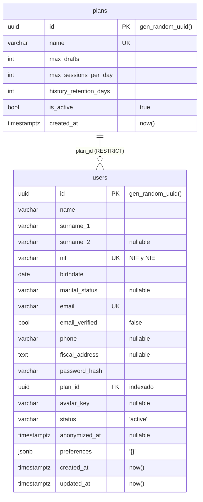

# Capa de persistencia y modelo de datos

Qué hay, cómo está organizado y cómo funciona. **Para trabajar con ello** —arrancar, comandos, escribir
una migración, resolver errores— está [migrations/README.md](../migrations/README.md); este documento no
explica ningún comando.

**Stack:** PostgreSQL 17 · SQLAlchemy 2.0 síncrono · driver psycopg 3 · Alembic · pydantic-settings.
Nada de async engine ni de psycopg2.

Las rutas de este documento son relativas a la raíz del repositorio.

---

## Estructura de carpetas

```
alembic.ini                        script_location + prepend_sys_path. SIN credenciales
migrations/
    env.py                         se ejecuta en cada comando de alembic
    script.py.mako                 plantilla de los ficheros generados
    versions/                      una migración por fichero, encadenadas
    README.md                      cómo trabajar con todo esto
src/
    config/settings.py             configuración tipada: entorno > .env > defecto
    storage/
        connectors/db.py           engine, pool, SessionLocal, get_db, Base
        entities/                  las tablas como clases
            __init__.py            registro: cada entidad nueva, una línea más
            mixins.py              columnas comunes: id UUID, created_at, updated_at
            plan.py  user.py
        crud/repository.py         acceso a datos
    models/                        esquemas Pydantic de la API. NO son tablas
tests/
    conftest.py                    fixtures de pytest-alembic
docker-compose.yml                 db (5432) y db_test (5433)
```

`src/models/` y `src/storage/entities/` se parecen y no son lo mismo: los primeros describen lo que
entra y sale por la API, los segundos describen tablas. Que `user.py` exista en ambos sitios es
deliberado, y por eso cada uno lo dice en su docstring.

| Servicio del compose | Puerto | Base | Persistencia |
|---|---|---|---|
| `db` | 5432 | `administracion` | volumen `postgres_data` |
| `db_test` | 5433 | `administracion_test` | tmpfs, se pierde al parar |

---

## Cómo funciona la capa

```
src/config/settings.py          de dónde sale la URL de conexión
        ↓
src/storage/connectors/db.py    engine + pool, SessionLocal, get_db, Base
        ↓
src/storage/entities/           plan.py, user.py  →  Base.metadata
        ↓
migrations/env.py               compara Base.metadata con la base real
        ↓
migrations/versions/            una migración por cambio, versionada en git
```

**`Base` es la pieza central.** Todas las entidades heredan de ella, así que todas quedan registradas
en `Base.metadata`: el catálogo de lo que el código cree que existe en la base. Ese objeto es lo que
Alembic lee después para comparar.

`Base` lleva además dos cosas que afectan a todas las tablas:

- **`NAMING_CONVENTION`** — la plantilla con la que se nombran índices y restricciones. Sin ella,
  Postgres inventa los nombres y Alembic no sabe cómo referirse a una restricción para borrarla en un
  `downgrade`. Es la razón de que el error de email duplicado diga exactamente
  `violates unique constraint "uq_users_email"`. Queda congelada desde la primera migración.
- **`type_annotation_map`** — hace que todo `Mapped[datetime]` sea `TIMESTAMPTZ` sin declararlo.

Una entidad solo entra en el catálogo si Python la ha **importado**. Un fichero de entidad que nadie
importa es invisible para Alembic; de ahí el registro explícito en `src/storage/entities/__init__.py`.

### Cómo se accede a la base desde un endpoint

```python
@router.get("/db")
def check_db(db: Session = Depends(get_db)):
    db.execute(text("SELECT 1"))
    return {"db": "ok"}
```

Es una función `def` normal, **no `async def`**: SQLAlchemy aquí es síncrono y FastAPI ejecuta estos
endpoints en un threadpool, sin bloquear el event loop. Si se declarase `async def`, cada consulta
bloquearía el bucle entero.

`get_db` cierra la sesión en su `finally`. Consecuencia: un endpoint no puede devolver directamente
un objeto ORM, porque FastAPI lo serializa después de ese cierre. Se convierte a Pydantic dentro del
endpoint, que es justo para lo que está `src/models/`.

---

## Cómo funciona Alembic

### El problema que resuelve

Las entidades describen tablas en Python; Postgres tiene tablas de verdad. Son dos cosas distintas y
se separan en cuanto alguien toca una sin tocar la otra.

`Base.metadata.create_all()` no sirve: solo crea las tablas que **faltan**. Sobre una que ya existe no
hace nada —ni añade la columna nueva, ni avisa—, así que funciona en local con la base vacía y falla en
cuanto hay datos. La alternativa de borrar y recrear pierde los datos.

Alembic convierte cada cambio de esquema en **un fichero de Python versionado en git** que sabe
aplicarse y deshacerse. Es control de versiones para la estructura de la base.

### La cadena de revisiones

Cada fichero de `migrations/versions/` tiene un id y apunta al anterior:

```python
revision = "cc9184fc36d1"   # el mío
down_revision = None        # el anterior; None = soy el primero
```

Eso los encadena, y esa cadena es el historial:

```
base ──> cc9184fc36d1 ──> (la siguiente) ──> head
         create_plans_and_users
```

`base` es el estado anterior a todo; `head`, el último eslabón. Los ids son aleatorios, no
correlativos: el orden lo da la cadena, no el nombre del fichero.

### El marcador

Alembic crea en la base una tabla suya, `alembic_version`, con **una sola fila**: el id de la última
migración aplicada. Ese es todo el estado que guarda.

```
administracion=# SELECT * FROM alembic_version;
 version_num
--------------
 cc9184fc36d1
```

**La fila dice qué se aplicó, no qué hay realmente.** Si alguien modifica una tabla a mano por `psql`,
Alembic no se entera y el marcador miente. De ahí que el esquema solo se toque por migración.

### Qué hace `env.py`

Se ejecuta en cada comando de Alembic y hace cuatro cosas:

1. **Importa `storage.entities`**, que es lo que llena `Base.metadata`. Sin esa línea toda migración
   saldría vacía.
2. **Fija `target_metadata = Base.metadata`**: el "lo que quiero" contra el que comparar.
3. **Decide a qué base conectarse.** Si alguien inyectó una conexión en `config.attributes["connection"]`
   la usa —eso lo hace pytest-alembic, y es lo que mantiene los tests lejos de la base de desarrollo—;
   si no, abre una con `settings.database_url`. La URL **no** está en `alembic.ini`: `sqlalchemy.url`
   está comentado a propósito, para que app y migraciones tengan una sola fuente de verdad y ninguna
   credencial acabe versionada.
4. **Activa `compare_type` y `compare_server_default`**, que vienen desactivadas de fábrica. Sin ellas,
   cambiar `String(50)` a `String(100)` pasaría desapercibido.

### Qué ve el autogenerate y qué no

Alembic **compara**, no adivina intenciones: lee la estructura real de Postgres, la contrasta con
`Base.metadata` y escribe las diferencias.

Detecta bien tablas y columnas añadidas o borradas, cambios de nullable, índices, restricciones unique,
claves foráneas y —con las opciones activadas— tipos y valores por defecto.

No detecta nada que exija entender la intención ni nada que no esté en la estructura: renombrados,
triggers, funciones, vistas, condiciones de índices parciales y cualquier cosa relacionada con el
contenido de las filas. Por eso el fichero generado se lee siempre antes de aplicarlo. La lista de
casos y cómo corregir cada uno está en [migrations/README.md](../migrations/README.md).

### Una migración no se queda a medias

`env.py` envuelve la ejecución en una transacción y Postgres soporta DDL transaccional: si hay que
aplicar cinco migraciones y la cuarta falla, **se deshacen las cinco** y la base queda como estaba. No
existe el estado "medio migrado" que sí sufren otros motores. Es una red de seguridad real, pero no
sustituye al backup en producción.

---

## El modelo



**`plans`** — límites de uso por plan de suscripción.

**`users`** — cuatro bloques: identidad, contacto, cuenta y ciclo de vida.

- `surname_2` es opcional: muchos extranjeros tienen un solo apellido.
- `nif` admite formato NIF y NIE. Solo el campo, la validación es de otro issue.
- `avatar_key` guarda la clave del object storage, no la imagen.
- `status` prevé `active`, `erasure_requested` y `anonymized`.
- **No incluye `sexual_orientation`**: categoría especial del art. 9 RGPD, decisión de equipo.

---

## Qué se puede comprobar

Salida real de la prueba funcional sobre la base recién creada:

```
1. Crear un plan
   id         : 84bf7acc-e1c0-4ccd-b644-fc9b32570a0f   (lo generó Postgres, tipo UUID)
   is_active  : True                                   (valor por defecto de la columna)

2. Dar de alta un usuario con ese plan
   status         : 'active'      (por defecto)
   email_verified : False         (por defecto)
   created_at     : 2026-08-02 14:40:46.245481+00:00
   ¿con zona horaria? True

3. La integridad se cumple
   email repetido   -> RECHAZADO (duplicate key value violates unique constraint "uq_users_email")
   plan inexistente -> RECHAZADO (violates foreign key constraint)
   ¿el error filtra el password_hash? False

4. ON DELETE RESTRICT
   borrar un plan con usuarios -> RECHAZADO

5. JSONB
   búsqueda por contenido -> ana@ejemplo.com, tema=oscuro
   tras mutar in-place    -> {'tema': 'oscuro', 'idioma': 'es', 'notificaciones': True}

6. updated_at se actualiza solo
   antes   : 14:40:46.313983+00:00
   después : 14:40:46.385575+00:00
```

El punto 3 importa: **las excepciones de base de datos no filtran datos personales al log.**
Sin `hide_parameters=True`, un alta con email repetido dejaría el hash de la contraseña, el
teléfono y la dirección fiscal escritos en el log del servidor.

---

## Decisiones y por qué

| Decisión | Motivo |
|---|---|
| PostgreSQL, no Mongo | Datos fiscales: hacen falta transacciones e integridad referencial. Y con `jsonb` también se guardan documentos |
| SQLAlchemy **síncrono** | Menos complejidad y menos trampas que el async. FastAPI lo absorbe con su threadpool |
| psycopg 3, no psycopg2 | Mantenido activamente, soporte real de tipos de Postgres |
| `ON DELETE RESTRICT`, nunca CASCADE | Decisión de equipo tomada en el issue #8: un borrado en cascada sobre datos personales es irreversible. La supresión es un proceso de **anonimización** controlado |
| `timestamptz` en todos los instantes | Sin zona, el valor guardado depende de la zona de quien insertó. El contenedor va en UTC y los clientes en Europe/Madrid |
| UUID en vez de enteros | No revela cuántos usuarios hay ni permite recorrer la tabla probando ids |
| Restricciones con nombre propio | Nombres deterministas e iguales en todos los entornos, y `downgrade` capaz de borrarlas |
| `jsonb` para `preferences` | Lo que varía entre usuarios y no merece columna propia. Se consulta e indexa dentro, y Postgres valida que el JSON esté bien formado |

---

## Pendiente de decidir

Nada de esto está implementado. Son decisiones abiertas, no instrucciones.

- **Sembrar un plan por defecto.** `users.plan_id` es NOT NULL y `plans` nace vacía, así que hoy no se
  puede dar de alta a nadie sin crear antes un plan a mano. Falta decidir si va en una migración de
  datos o en un script de arranque.
- **Estrategia de anonimización.** El equipo ha descartado el `ON DELETE CASCADE` a favor de anonimizar,
  y el esquema ya está montado para ello (`status = 'anonymized'`, `anonymized_at`, FKs en RESTRICT).
  Lo que falta es el procedimiento. Cuatro preguntas abiertas:
  1. **Qué se sobrescribe.** Las columnas de identidad (`name`, `surname_1`, `nif`, `birthdate`,
     `email`, `password_hash`) son NOT NULL, así que hay que **sobrescribirlas, no vaciarlas**. Con qué
     valores, teniendo en cuenta que `nif` y `email` son UNIQUE y dos anonimizados no pueden colisionar
     (lo habitual: derivar del `id`, que ya es único).
  2. **Qué se conserva.** Un usuario anonimizado sigue teniendo trámites presentados, y eso tiene
     plazos de conservación fiscales propios que no dependen del RGPD.
  3. **Qué se borra de verdad.** Los ficheros del object storage y los vectores de Qdrant no los
     alcanza ningún UPDATE: hacen falta pasos aparte, y son los únicos irreversibles.
  4. **Si los anonimizados van a una tabla aparte.** Sacarlos de `users` deja la tabla viva limpia y
     aísla lo conservado, pero rompe las FKs de sus trámites. Alternativa: quedarse en `users` con
     `status` y un `jsonb` con lo mínimo que haya que conservar.
- **Modelo de sesiones y chats, con el volumen en mente.** Sin diseñar todavía. Guardar una fila por
  mensaje da métricas (consultas/día, latencia, coste) pero crece rápido: hay que decidir cuánto
  historial se conserva por plan (`history_retention_days` ya está en `plans`), si las conversaciones
  viejas se compactan en un resumen en vez de guardarse enteras, y si el histórico se particiona por
  fecha. Decidirlo ahora es barato; después es una migración de datos sobre la tabla más grande.
- **Backups.** No hay ninguno automatizado. Hoy la copia se hace a mano antes de tocar algo delicado
  (procedimiento en [migrations/README.md](../migrations/README.md)). En cuanto haya un entorno
  desplegado hacen falta `pg_dump` programado y point-in-time recovery.
- **Validar `status`.** Es `String(32)` sin CHECK: hoy entra cualquier cadena, incluido un typo.
- **Normalizar `email` y `nif`.** El UNIQUE de Postgres distingue mayúsculas, así que `12345678z` y
  `12345678Z` conviven como dos personas. Arreglarlo después exige migración de datos con deduplicación.
- **Esquema `logging` para auditoría.** La propuesta del issue crea un esquema aparte. El autogenerate
  solo mira el esquema por defecto: haría falta `include_schemas=True` en `migrations/env.py`, y con esa
  opción hay que filtrar con `include_object` para que Alembic no proponga borrar lo que no conoce.
- **Embeddings del RAG:** `pgvector` en esta misma base o almacén aparte.

Fuera de alcance de este issue: backups automatizados y object storage para los avatares.
