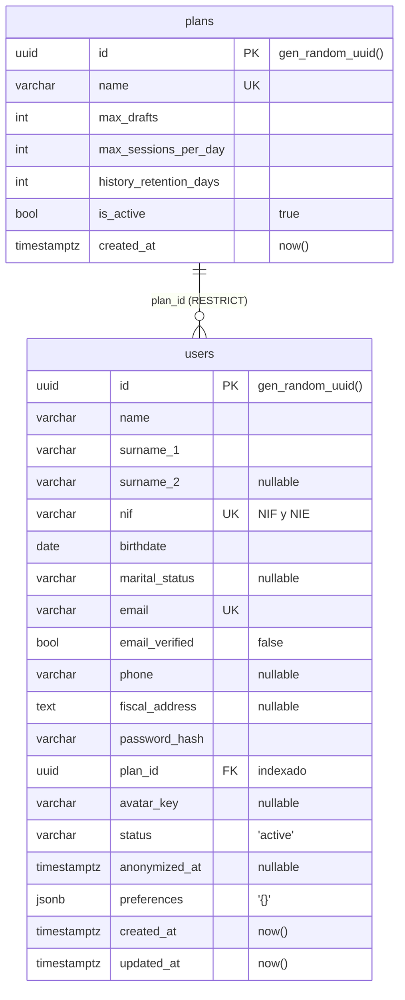

# Capa de persistencia y modelo de datos

Qué hay, cómo está organizado y cómo funciona. **Para trabajar con ello** —arrancar, comandos, escribir
una migración, resolver errores— está [migrations/Guide.md](../migrations/Guide.md); este documento no
explica ningún comando.

**Stack:** PostgreSQL 17 · SQLAlchemy 2.0 síncrono · driver psycopg 3 · Alembic · pydantic-settings.
Nada de async engine ni de psycopg2.

Las rutas de este documento son relativas a la raíz del repositorio.

---

## Estructura de carpetas

```
alembic.ini                        script_location + prepend_sys_path. SIN credenciales
migrations/
    env.py                         se ejecuta en cada comando de alembic
    script.py.mako                 plantilla de los ficheros generados
    versions/                      una migración por fichero, encadenadas
    Guide.md                       cómo trabajar con todo esto
src/
    config/settings.py             configuración tipada: entorno > .env > defecto
    storage/
        base.py                    Base: metadata, nombres de restricciones y tipos
        connectors/db.py           engine, pool, SessionLocal, get_db
        entities/                  las tablas como clases
            __init__.py            registro: cada entidad nueva, una línea más
            mixins.py              columnas comunes: id UUID, created_at, updated_at
            plan.py  user.py
        crud/repository.py         acceso a datos
    models/                        esquemas Pydantic de la API. NO son tablas
tests/
    conftest.py                    fixtures de pytest-alembic
docker-compose.yml                 db (5432) y db_test (5433)
```

`src/models/` y `src/storage/entities/` se parecen y no son lo mismo: los primeros describen lo que
entra y sale por la API, los segundos describen tablas. Que `user.py` exista en ambos sitios es
deliberado, y por eso cada uno lo dice en su docstring.

| Servicio del compose | Puerto | Base | Persistencia |
|---|---|---|---|
| `db` | 5432 | `administracion` | volumen `postgres_data` |
| `db_test` | 5433 | `administracion_test` | tmpfs, se pierde al parar |

---

## Cómo funciona la capa

```
src/storage/base.py             Base: metadata, naming convention, tipos
        ↓
src/storage/entities/           plan.py, user.py  →  Base.metadata
        ↓
migrations/env.py               compara Base.metadata con la base real
        ↓
migrations/versions/            una migración por cambio, versionada en git

src/config/settings.py  →  src/storage/connectors/db.py   engine + pool, sesiones
```

Las dos ramas se cruzan solo en `migrations/env.py`, que necesita el modelo **y** una
conexión. **Importar el modelo no arrastra el engine**: describir las tablas no requiere
driver de base de datos ni configuración, y por eso `storage/base.py` está separado de
`connectors/db.py`.

`Base.metadata` es el punto de contacto entre la aplicación y Alembic: el único sitio del que Alembic
saca "lo que debería existir". Todo lo demás son detalles de conexión.

Tres cosas del montaje que no se deducen leyendo el código:

- **`NAMING_CONVENTION` está congelada** desde la primera migración. Con los nombres que inventa
  Postgres, un `downgrade` no puede referirse a la restricción que tiene que borrar. Cambiar la
  plantilla ahora obliga a renombrar restricciones a mano en todos los entornos.
- **`type_annotation_map` mapea `datetime` a `TIMESTAMPTZ`** para todas las tablas, así que la zona
  horaria no se declara columna a columna.
- **El registro es por import.** Una entidad que nadie importa no está en `Base.metadata`, y el
  autogenerate produce una migración vacía sin error. De ahí `entities/__init__.py`.

### Sesiones en los endpoints

Los endpoints que tocan la base se declaran `def`, no `async def`: el engine es síncrono y FastAPI
saca las funciones `def` a un threadpool. Con `async def` cada consulta bloquearía el event loop.

`get_db` cierra la sesión en el `finally` y `expire_on_commit` está en su valor por defecto. Un
endpoint que devuelva la entidad ORM directamente falla: FastAPI la serializa después del cierre y el
acceso a un atributo expirado intenta releer con la sesión ya muerta. La conversión a Pydantic va
dentro del endpoint, para eso está `src/models/`.

`autoflush=False`: las escrituras pendientes no se emiten antes de cada consulta. Para leer en la
misma transacción algo que acabas de escribir, `flush()` explícito.

---

## Cómo funciona Alembic

`create_all()` solo crea las tablas que faltan: sobre una que ya existe no altera nada ni avisa. Por
eso el esquema se versiona en ficheros en vez de derivarse del modelo en tiempo de arranque.

### Estado y cadena

Cada fichero de `versions/` declara `revision` y `down_revision`, y esa referencia al anterior forma la
cadena. `base` es el estado vacío, `head` el último eslabón. Los ids son aleatorios: el orden lo da la
cadena, no el nombre del fichero ni la fecha.

Lo aplicado vive en `alembic_version`, una tabla de una sola fila. **Registra qué se aplicó, no qué
existe:** un `ALTER TABLE` a mano por `psql` la deja mintiendo, y a partir de ahí el autogenerate
produce diffs falsos.

### `env.py`

Se ejecuta en cada comando de Alembic. Lo que decide:

- **`target_metadata = Base.metadata`**, previo `import storage.entities` para poblarlo.
- **De dónde sale la URL.** `sqlalchemy.url` está comentado en `alembic.ini` a propósito: la URL viene
  de `settings`, así que aplicación y migraciones comparten fuente y no hay credenciales versionadas.
- **Qué conexión usar.** Si `config.attributes["connection"]` trae una, la usa en lugar de abrir la
  suya. Es el punto de entrada de pytest-alembic y lo único que impide que `test_up_down_consistency`
  —que hace `downgrade base`— corra contra la base de desarrollo.
- **`compare_type=True` y `compare_server_default=True`**, ambas desactivadas por defecto en Alembic.
  Sin ellas, un `String(50)` → `String(100)` o un cambio de `server_default` no se detectan.

### Límites del autogenerate

Compara estructura contra `Base.metadata`; no interpreta intenciones. Detecta tablas, columnas,
nullable, índices, unique, claves foráneas y —con las opciones anteriores— tipos y defaults.

No detecta renombrados (los ve como drop + add, con pérdida de datos), triggers, funciones, vistas,
condiciones de índices parciales, ni nada que dependa del contenido de las filas. Los casos concretos y
su corrección están en [migrations/Guide.md](../migrations/Guide.md).

### Transaccionalidad

`env.py` envuelve la ejecución en una transacción y Postgres soporta DDL transaccional: si
`upgrade head` aplica cinco migraciones y la cuarta falla, se revierten las cinco. No hay estado
intermedio. Es una transacción **por ejecución**, no por migración: `transaction_per_migration` no está
activado. No sustituye al backup en producción.

---

## El modelo



**`plans`** — límites de uso por plan de suscripción.

**`users`** — cuatro bloques: identidad, contacto, cuenta y ciclo de vida.

- `surname_2` es opcional: muchos extranjeros tienen un solo apellido.
- `nif` admite formato NIF y NIE. Solo el campo, la validación es de otro issue.
- `avatar_key` guarda la clave del object storage, no la imagen.
- `status` prevé `active`, `erasure_requested` y `anonymized`.
- **No incluye `sexual_orientation`**: categoría especial del art. 9 RGPD, decisión de equipo.

---

## Comprobado

Prueba funcional sobre la base recién creada:

- Los defaults los aplica el servidor, no Python: `gen_random_uuid()`, `now()`, `'active'`, `false`.
  `created_at` vuelve con offset, o sea `TIMESTAMPTZ` real.
- Integridad: email duplicado → `uq_users_email`; `plan_id` inexistente → violación de FK; borrar un
  plan con usuarios → rechazado por el `RESTRICT`.
- JSONB: consulta por contenido, y una mutación in-place persiste gracias a `MutableDict`.
- `updated_at` cambia solo en el UPDATE.
- **Las excepciones no filtran datos personales.** Sin `hide_parameters=True`, el alta con email
  duplicado dejaría `password_hash`, teléfono y dirección fiscal en el log del servidor: SQLAlchemy
  incluye `[parameters: {...}]` en el `str()` de toda excepción de BD, con `echo` o sin él.

---

## Decisiones y por qué

| Decisión | Motivo |
|---|---|
| PostgreSQL, no Mongo | Datos fiscales: hacen falta transacciones e integridad referencial. Y con `jsonb` también se guardan documentos |
| SQLAlchemy **síncrono** | Menos complejidad y menos trampas que el async. FastAPI lo absorbe con su threadpool |
| psycopg 3, no psycopg2 | Mantenido activamente, soporte real de tipos de Postgres |
| `ON DELETE RESTRICT`, nunca CASCADE | Decisión de equipo tomada en el issue #8: un borrado en cascada sobre datos personales es irreversible. La supresión es un proceso de **anonimización** controlado |
| `timestamptz` en todos los instantes | Sin zona, el valor guardado depende de la zona de quien insertó. El contenedor va en UTC y los clientes en Europe/Madrid |
| `id` UUID, no entero autoincremental | No revela cuántos registros hay ni permite recorrer la tabla probando ids. Lo genera Postgres con `gen_random_uuid()`, nativa desde la versión 13, que devuelve un UUID v4 — el mismo que usa la clase de dominio de la PR #45, así que las dos capas coinciden |
| Restricciones con nombre propio | Nombres deterministas e iguales en todos los entornos, y `downgrade` capaz de borrarlas |
| `jsonb` para `preferences` | Lo que varía entre usuarios y no merece columna propia. Se consulta e indexa dentro, y Postgres valida que el JSON esté bien formado |

---

## Pendiente de decidir

Nada de esto está implementado. Son decisiones abiertas, no instrucciones.

- **Sembrar un plan por defecto.** `users.plan_id` es NOT NULL y `plans` nace vacía, así que hoy no se
  puede dar de alta a nadie sin crear antes un plan a mano. Falta decidir si va en una migración de
  datos o en un script de arranque.
- **Estrategia de anonimización.** El equipo ha descartado el `ON DELETE CASCADE` a favor de anonimizar,
  y el esquema ya está montado para ello (`status = 'anonymized'`, `anonymized_at`, FKs en RESTRICT).
  Lo que falta es el procedimiento. Cuatro preguntas abiertas:
  1. **Qué se sobrescribe.** Las columnas de identidad (`name`, `surname_1`, `nif`, `birthdate`,
     `email`, `password_hash`) son NOT NULL, así que hay que **sobrescribirlas, no vaciarlas**. Con qué
     valores, teniendo en cuenta que `nif` y `email` son UNIQUE y dos anonimizados no pueden colisionar
     (lo habitual: derivar del `id`, que ya es único).
  2. **Qué se conserva.** Un usuario anonimizado sigue teniendo trámites presentados, y eso tiene
     plazos de conservación fiscales propios que no dependen del RGPD.
  3. **Qué se borra de verdad.** Los ficheros del object storage y los vectores de Qdrant no los
     alcanza ningún UPDATE: hacen falta pasos aparte, y son los únicos irreversibles.
  4. **Si los anonimizados van a una tabla aparte.** Sacarlos de `users` deja la tabla viva limpia y
     aísla lo conservado, pero rompe las FKs de sus trámites. Alternativa: quedarse en `users` con
     `status` y un `jsonb` con lo mínimo que haya que conservar.
- **Modelo de sesiones y chats, con el volumen en mente.** Sin diseñar todavía. Guardar una fila por
  mensaje da métricas (consultas/día, latencia, coste) pero crece rápido: hay que decidir cuánto
  historial se conserva por plan (`history_retention_days` ya está en `plans`), si las conversaciones
  viejas se compactan en un resumen en vez de guardarse enteras, y si el histórico se particiona por
  fecha. Decidirlo ahora es barato; después es una migración de datos sobre la tabla más grande.
- **Backups.** No hay ninguno automatizado. Hoy la copia se hace a mano antes de tocar algo delicado
  (procedimiento en [migrations/Guide.md](../migrations/Guide.md)). En cuanto haya un entorno
  desplegado hacen falta `pg_dump` programado y point-in-time recovery.
- **Coordinar la identidad con la clase de dominio (PR #45).** Las dos capas usan UUID v4,
  así que son compatibles, pero quedan dos flecos: el dominio genera el id en Python con
  `uuid4()` mientras la tabla lo genera con `server_default`, y si la aplicación pasa el id
  al guardar el default no llega a usarse nunca — hay que decidir quién manda. Además, el
  dominio llama `user_id` al campo que la tabla llama `id`.
- **Auditoría con `serial`.** El esquema de auditoría propuesto en el issue usa un entero
  autoincremental. Para una tabla de log es defendible, pero conviene decidirlo a propósito
  y no que salga por descuido.
- **Validar `status`.** Es `String(32)` sin CHECK: hoy entra cualquier cadena, incluido un typo.
- **Normalizar `email` y `nif`.** El UNIQUE de Postgres distingue mayúsculas, así que `12345678z` y
  `12345678Z` conviven como dos personas. Arreglarlo después exige migración de datos con deduplicación.
- **Esquema `logging` para auditoría.** La propuesta del issue crea un esquema aparte. El autogenerate
  solo mira el esquema por defecto: haría falta `include_schemas=True` en `migrations/env.py`, y con esa
  opción hay que filtrar con `include_object` para que Alembic no proponga borrar lo que no conoce.
- **Embeddings del RAG:** `pgvector` en esta misma base o almacén aparte.

Fuera de alcance de este issue: backups automatizados y object storage para los avatares.
